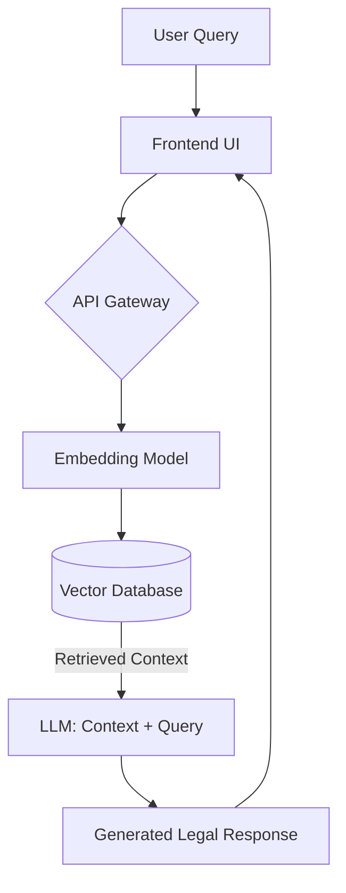

# ⚖️ DoJ-Chatbot: Legal Data Pipeline & AI Assistant

> **A production-grade legal data acquisition system feeding a RAG-based AI.**
> *Demonstrating robust web scraping, PDF parsing, and vector database ingestion.*

## 🎯 Project Focus: Data Engineering

While the frontend serves as a chatbot, the core of this project is a **resilient web scraping engine** designed to aggregate, clean, and index dispersed legal information from government portals.

This repository demonstrates the ability to:

1. **Bypass Basic Protections:** Automated navigation of government portal structures.
2. **Ingest Complex Formats:** converting non-machine-readable PDFs into structured JSON.
3. **Maintain Data Integrity:** Error handling and validation during the extraction process.

## ⚙️ The Scraping Architecture

The system uses a custom-built **ETL (Extract, Transform, Load)** pipeline to populate the Knowledge Base:

### 1. Extraction Engine (The Scraper)

* **Headless Browsing:** Utilizes **Playwright/Selenium** to handle dynamic JavaScript-heavy legal portals.
* **Session Management:** [Critical for Portals] Implements logic to maintain valid session cookies and handle `JSESSIONID` rotation during long extraction tasks.
* **Rate Limit Handling:** Built-in exponential backoff and proxy rotation capability to respect server load and avoid IP bans.
* **Target:** Scrapes Case Law, Constitution Articles, and BNS (Bharatiya Nyaya Sanhita) amendments.

### 2. Transformation Layer (The Parser)

* **OCR & PDF Processing:** Integrates `PyMuPDF` and `Tesseract` to extract text from scanned court documents and legal gazettes.
* **Data Structuring:** Converts raw text blocks into semantic chunks (Case ID, Ruling, Judge, Date) for database storage.

### 3. Loading (The Vector Store)

* Pushes cleaned data into **ChromaDB/Pinecone** for high-speed retrieval.

---

## 🛠️ Technical Stack (Data Focus)

| Component | Technology | Purpose |
| --- | --- | --- |
| **Scraping** | **Playwright / Selenium** | Handling JS rendering, Session Cookies, Auth flows |
| **Request Handling** | **Requests / HTTPX** | High-speed async requests for static assets |
| **Parsing** | **BeautifulSoup4 / LXML** | DOM Traversal and HTML Parsing |
| **PDF Engine** | **PyPDF2 / OCR** | Extracting text from legal notices/judgments |
| **Database** | **PostgreSQL / Supabase** | Storing structured metadata (Case relations) |

---

## 🚀 Key Scraping Capabilities Demonstrated

### ✅ Session Persistence & Auth

The bot enables automated login flows to access restricted legal repositories, maintaining session persistence to download bulk documents without re-authenticating for every request.

### ✅ Bulk PDF Pipeline

Automated the retrieval of 1000+ legal documents, passing them through a cleaning pipeline to strip headers/footers and normalize text before embedding.

### ✅ Resilience

Includes try/catch blocks for network timeouts and selector changes, ensuring the scraper recovers automatically if the target site layout shifts slightly.

---

## 🏗️ Setup & Installation

### Prerequisites

* Python 3.10+
* Chrome/Chromium (for Headless Browser)

### Installation

```bash
git clone https://github.com/Pratz1337/DoJ-Chatbot.git
cd DoJ-Chatbot

# Install dependencies including scraping tools
pip install -r requirements.txt
playwright install  # Installs browser binaries

```

### Running the Scraper

```bash
# Run the standalone data ingestion script
python scripts/ingest_legal_data.py --source="DoJ_Portal" --limit=100

```

---


